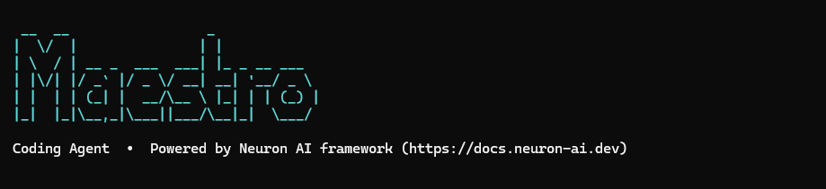

# Maestro - The First PHP-Based AI Coding Agent

**Maestro** is the first coding agent built entirely in PHP with the [Neuron AI framework](https://docs.neuron-ai.dev).
It brings powerful AI-assisted development to the PHP ecosystem through an elegant CLI tool that combines intelligent code analysis
with interactive tool approval.


[](https://github.com/neuron-core/neuron-ai)

## About Maestro

While most AI coding agents are written in Python or TypeScript, Maestro demonstrates that PHP can deliver a world-class AI coding experience. Built on the modern [Neuron AI framework](https://docs.neuron-ai.dev), Maestro provides:

- **Native PHP Architecture**: Every component—agent orchestration, CLI interface, event system—is implemented in PHP
- **Tool Approval System**: Interactive confirmation before the agent executes filesystem operations
- **Multi-Provider AI Support**: Choose from Anthropic Claude, OpenAI, Gemini, Cohere, Mistral, Ollama, Grok, or Deepseek
- **MCP Integration**: Extend capabilities with Model Context Protocol servers
- **Sophisticated Output Rendering**: Beautiful diffs, colored syntax highlighting, and intuitive tool call visualization
- **Event-Driven Design**: A clean PSR-14 event system that allows extensible observability and customization

## Requirements

- PHP >= 8.1
- Composer

## Installation

### Global Installation

Install Maestro globally to use it from any directory:

```bash
composer global require neuron-core/maestro
```

Ensure Composer's global bin directory is in your PATH:

```bash
# Add to your shell profile (~/.bashrc, ~/.zshrc, etc.)
export PATH="$HOME/.config/composer/vendor/bin:$PATH"

# Or find your global bin directory
composer global config bin-dir --absolute
```

### Per Project Installation

Install as a dev dependency in your project:

```bash
composer require --dev neuron-core/maestro
```

Run the command:

```bash
vendor/bin/maestro
```

## Configuration

Before using Maestro, configure your AI provider and API key.

### Setting Up `.maestro/settings.json`

Create a `.maestro` directory in your project and add a `settings.json` file:

```bash
mkdir -p .maestro && printf "{\n}" > .maestro/settings.json
```

#### Anthropic

```json
{
    "provider": {
        "type": "anthropic",
        "api_key": "sk-ant-your-api-key-here",
        "model": "claude-sonnet-4-20250514",
        "max_tokens": 8192
    }
}
```

#### OpenAI

```json
{
    "provider": {
        "type": "openai",
        "api_key": "sk-your-openai-key-here",
        "model": "gpt-4",
        "max_tokens": 8192
    }
}
```

#### Google Gemini

```json
{
    "provider": {
        "type": "gemini",
        "api_key": "your-gemini-api-key",
        "model": "gemini-pro",
        "max_tokens": 8192
    }
}
```

#### Local Ollama

```json
{
    "provider": {
        "type": "ollama",
        "base_url": "http://localhost:11434",
        "model": "llama2"
    }
}
```

#### Other Providers

Additional supported providers with similar configuration:

| Provider | Type | API Key |
|---|---|---|
| **Cohere** | `"cohere"` | `api_key` |
| **Mistral** | `"mistral"` | `api_key` |
| **Grok (xAI)** | `"xai"` or `"grok"` | `api_key` |
| **Deepseek** | `"deepseek"` | `api_key` |

### Context File Configuration

You can provide project-specific instructions by adding a `context_file` setting. The agent will load this file and append its content to its system instructions.

If no `context_file` is specified, the agent will look for `Agents.md` in the project root. If the file doesn't exist, no additional context is attached.

```json
{
    "provider": {
        "type": "anthropic",
        "api_key": "sk-ant-your-api-key-here"
    },
    "context_file": "docs/Agent.md"
}
```

The `Agents.md` (or your custom file) should contain project-specific guidelines:

```markdown
# Project Guidelines

## Coding Standards
- Use PSR-12 coding style
- All methods must have return type declarations
- Maximum line length: 120 characters

## Architecture Notes
- Controllers should only handle HTTP concerns
- Business logic belongs in the Service layer
- Use dependency injection for all dependencies
```

### MCP Server Configuration

Add Model Context Protocol servers to extend the agent's capabilities:

```json
{
  "mcp_servers": {
    "filesystem": {
      "command": "npx",
      "args": ["-y", "@modelcontextprotocol/server-filesystem", "/path/to/workspace"]
    },
    "brave-search": {
      "command": "uvx",
      "args": ["mcp-brave-search"]
    },
    "github": {
      "command": "npx",
      "args": ["-y", "@modelcontextprotocol/server-github"],
      "env": {
        "GITHUB_PERSONAL_ACCESS_TOKEN": "your-github-token"
      }
    }
  }
}
```

**Note**: The `.maestro/settings.json` file should be located in your current working directory when running `maestro`.

## Usage

### Interactive Mode

Start an interactive chat session:

```bash
maestro
```

### Single Question

Ask a single question without entering interactive mode:

```bash
maestro "How do I fix this PHP error?"
```

### Project Context

Navigate to your project directory and start chatting—the agent can read and analyze files in your current directory:

```bash
cd /path/to/your/project
maestro
```

**Example interactions:**

```bash
# Ask about your codebase
> What does this project do?

# Request code review
> Review the UserController.php file for security issues

# Get help debugging
> I'm getting a "Class not found" error in Auth.php

# Request refactoring
> Can you refactor the UserService class to use dependency injection?
```

### Tool Approval

When the agent proposes a tool operation, you'll be prompted to approve it. Choose from:

- **Allow once**: Approve this specific operation
- **Allow for session**: Approve all operations of this type during the current session
- **Always allow**: Approve permanently (saved to the settings file)
- **Deny**: Reject this operation

## Architecture Overview

Maestro is built on a clean, modular architecture:

```
bin/maestro
  └─ MaestroCommand (Symfony Console)
       ├─ Settings (loads .maestro/settings.json)
       ├─ EventDispatcher + CliOutputListener
       └─ AgentOrchestrator
            └─ CodingAgent (extends NeuronAI Agent)
                 ├─ ProviderFactory → AIProviderInterface
                 ├─ FileSystemToolkit (read-only FS tools)
                 └─ McpConnector[] (optional MCP servers)
```

### Key Components

- **`CodingAgent`**: Extends `NeuronAI\Agent\Agent` with a tool approval middleware that interrupts execution for user confirmation
- **`AgentOrchestrator`**: Drives the chat loop, catching workflow interrupts and dispatching approval events
- **`MaestroCommand`**: Symfony Console entry point that bootstraps settings and runs the interactive REPL
- **`Settings`**: Loads `.maestro/settings.json` with dot-notation access and persistent `allowed_tools` tracking
- **`ProviderFactory`**: Maps provider types (`anthropic`, `openai`, `gemini`, `cohere`, `mistral`, `ollama`, `xai`/`grok`, `deepseek`) to Neuron AI provider instances

### Event System

A lightweight PSR-14-compatible dispatcher flows three events:

| Event | Trigger |
|---|---|
| `AgentThinkingEvent` | Before each AI call |
| `AgentResponseEvent` | When AI returns a message |
| `ToolApprovalRequestedEvent` | When tool approval is needed |

### Rendering Pipeline

Beautiful tool call visualization through the rendering system:

- **`ToolRendererMap`**: Registry mapping tool names to specialized renderers
- **`SnippetRenderer`**: Shows key argument fields (file paths, patterns, etc.)
- **`FileChangeRenderer`**: Produces unified diffs with ANSI coloring via `DiffRenderer`
- **`DiffRenderer`**: Wraps Tempest Highlighter with `DiffTerminalTheme`

## Contributing

Contributions are welcome! Please feel free to submit a Pull Request.

## License

This project is licensed under the MIT License - see the [LICENSE](LICENSE) file for details.

## Credits

Built with:
- [Neuron AI](https://docs.neuron-ai.dev/) - PHP agentic framework
- [Symfony Console](https://symfony.com/doc/current/console.html) - CLI component

---

Made with ❤️ by [Neuron AI](https://github.com/neuron-core/neuron-ai) team
